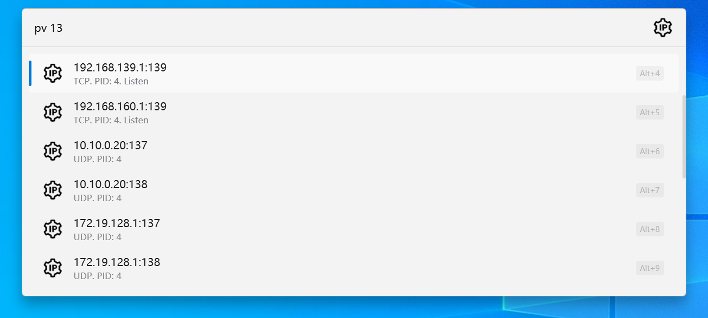
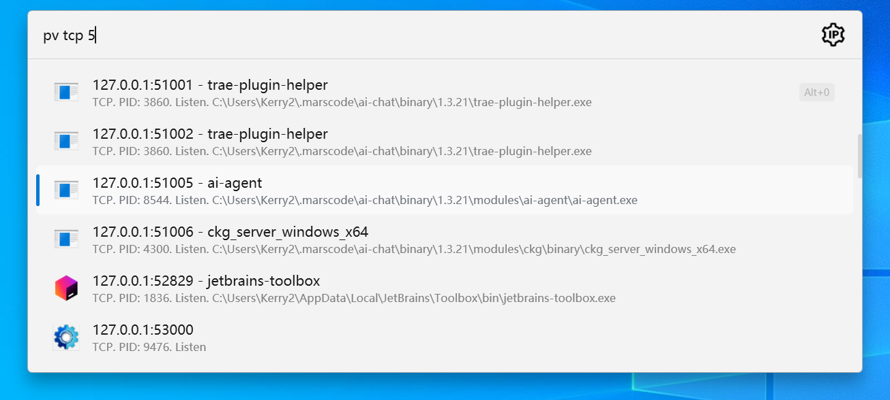
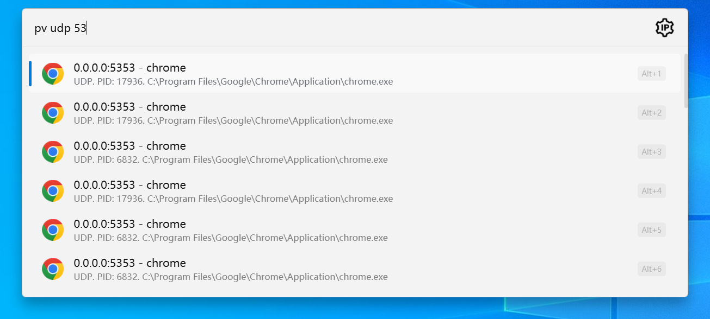
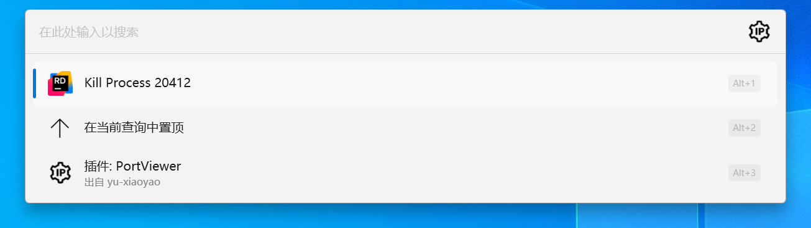

Flow.Launcher.Plugin.PortViewer
==================
### Description
> View the Tcp or udp port process info and kill the process.


A plugin for the [Flow launcher](https://github.com/Flow-Launcher/Flow.Launcher).

### Usage

    pv <arguments>


#### all all port process
```shell
pv 1080
```




#### all tcp port process
```shell
pv 1080
```



#### all udp port process
```shell
pv 1080
```




#### Context Menu for kill process by Pid
```shell
pv 1080
```

